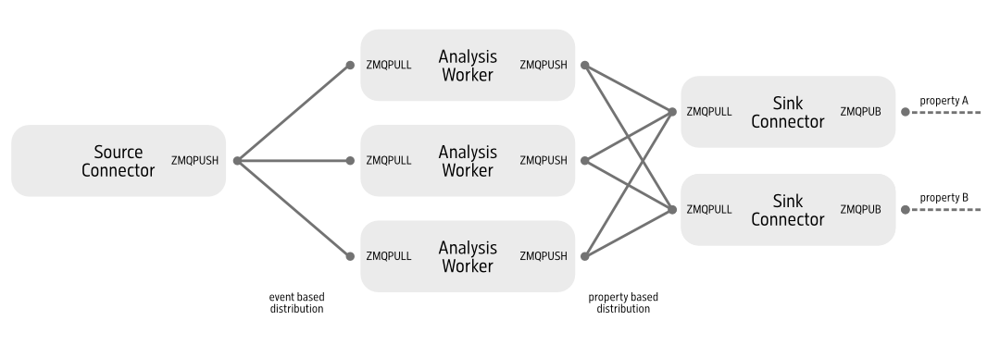

# Basic Usage

A ripflow pipeline is meant to be inserted into data streams where it can be used to apply arbitrary analysis pipelines to the data. The data is read from a source connector, processed by a user-defined analysis pipeline and published via a sink connector.

A basic middle layer analysis server can look like the following:

```python
from ripflow import Ripflow
from ripflow.connectors.source import PydoocsSourceConnector
from ripflow.connectors.sink import ZMQSinkConnector
from ripflow.serializers import JsonSerializer
from ripflow.analyzers import ImageProjector

# Define connector for incoming data (here pydoocs zmq)
source_connector = PydoocsSourceConnector(
    source_properties=["DATA/SOURCE/ADDRESS"])
# Define analysis pipeline, here simulate a 200 ms latency
analyzer = ImageProjector(fake_load=0.2)
# Define output connector. This one serializes the data
# as a json string and sends each property via a ZMQ PUB socket
sink_connector = ZMQSinkConnector(port=1337, serializer=JsonSerializer())

# Create server instance
server = Ripflow(
        source_connector=source_connector,
        sink_connector=sink_connector,
        analyzer=analyzer,
        n_workers=10)

# Run event loop.
server.event_loop()
```

In the example above, the incoming image data stream is pulled from a DOOCS server via a `PydoocsSourceConnector`. The data is distributed in round-robin fashion between 10 workers, which apply the `ImageProjector` analysis pipeline to the data. The result is then serialized as a json string and published via a ZMQ PUB socket.

Internally the server uses ZeroMQ to communicate between the processes that handle grabbing, analyzing and sending the data. The general architecture looks like this:


